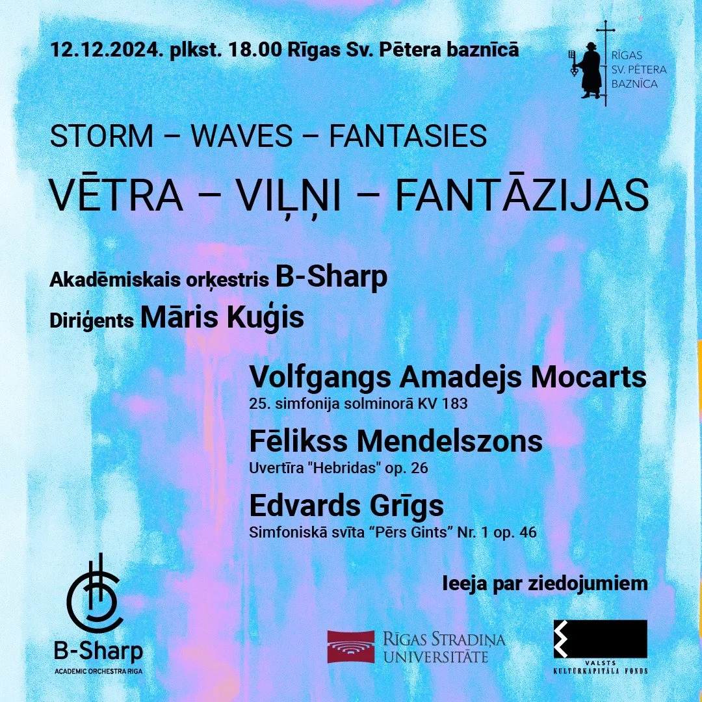

<h1>News</h1>

<h2>Join B-Sharp!</h2>

06-01-2025 - Hi! It's time for inspiration to play some music! We're looking for new members to join our orchestra again! If you play a string instrument, [sign up](https://forms.gle/SP4GanVT4LYa4C1d8) for our auditions and stay updated!

---

<h2><strong>Academic string orchestra B-Sharp invites to the concert "Storm-Waves-Fantasies"</strong></h2>

Academic string orchestra *B-Sharp* **invites** you to an evening of unforgettable classical music at **St. Peter's Church on December 12, 2024, at 6:00 PM**. The concert program, titled **"Storm-Waves-Fantasies,"** explores the unique soundscapes and imaginative worlds of Wolfgang Amadeus Mozart, Felix Mendelssohn, and Edvard Grieg.

Curated with the concept of "environmental chronicles captured in music," the program highlights each composer's reflections, experiments, and interpretations of the natural and imagined worlds around them. Whether it's the romanticized storm landscapes of Mozart's Symphony No. 25 (1773), the evocative sea birds and waves in Mendelssohn's Concert Overture *The Hebrides* (1830), or the fantastic soundscapes from Grieg's *Peer Gynt* (1867), the concert promises a journey through almost a century of musical evolution.

<h2><strong>A Special Collaboration with Māris Kuģis</strong></h2>

This performance will be led by the master student of conducting at JVLMA **Māris Kuģis**, a Sinfonietta Riga oboist known for his ability to bring both passion and precision to every performance. Recently Māris Kuģis has participated in well known conductor Paavo Järvi masterclasses. As an author of concert idea his expertise and dynamic leadership promises to guide the B-Sharp Orchestra through this powerful and evocative repertoire.

<h2><strong>About B-Sharp Orchestra</strong></h2>

B-Sharp Orchestra is a first academic string orchestra composed of local and international students and recent graduates from Riga's higher education institutions. The orchestra began its journey led by international medicine students from **Riga Stradiņš university** and **Artūrs Gailis**, at that time violist at Sinfonietta Rīga a recent conducting graduate from JVLMA, in Autumn 2017, united by the passion to make music in a collaborative, open, and joyful environment. The **2024 Autumn Season** marks a milestone for the orchestra, as it ventures into performing full-scale symphonic works for the first time.

<h2><strong>Previous Highlights</strong></h2>

In its previous projects, *B-Sharp* performed music by local and international composers from various periods - ranging from baroque up to contemporary. For our contemporary works, the orchestra previously worked together with composers studying at the Jāzeps Vītols Latvian Academy of Music - Ritvars Garoza and Līva Blūma. *B Sharp* Open rehearsals in September 2024 attracted students from Latvia, Sweden, Germany and Turkey, establishing the orchestra as a vibrant new voice in Riga's classical music scene. Future engineers, artists, doctors, musicians and economists unite in B-Sharp's concerts to create music together under the guidance of open and talented artists and musicians.

Project "Storm-Waves-Fantasies" is supported by State Culture Capital Foundation (SCCF), RSU Student Union and St. Peter's Church.

<h2><strong>Event Details</strong></h2>

- **Concert Program**: "Storm-Waves-Fantasies"
- **Date and Time**: December 12, 2024, at 6:00 PM
- **Venue**: St. Peter's Church, Reformācijas Laukums 1, Riga
- **Admission**: With donations warmly appreciated to support the church.

<h2><strong>Connect With Us</strong></h2>

To learn more about B-Sharp Orchestra and stay updated on future events, visit our Facebook page at **fb.me/AOBSharp** or contact us via email at **BSharpOrchestra@gmail.com**.

Join us as we celebrate the power of music to inspire and connect!

<h1><strong>Akadēmiskais stīgu orķestris <em>B-Sharp</em> aicina uz koncertu "Vētra- Viļņi-Fantāzijas"</strong></h1>

Akadēmiskais stīgu orķestris *B-Sharp* aicina uz koncertu "Vētra- Viļņi- Fantāzijas" ceturtdien, **12. decembrī plkst. 18.00 Svētā Pētera baznīcā**. Koncertprogramma "Vētra-Viļņi - Fantāzijas" iepazīstinās ar Volfganga Amadeja Mocarta, Fēliksa Mendelszona un Edvarda Grīga unikālajām skaņu ainavām un tēlainajām pasaulēm.

Koncertprogramma "Vētra-Viļņi-Fantāzijas" koncepcija balstās uz interpretācijām par Volfganga Amadeja Mocarta (1756-1791), Fēliksa Mendelsona (1805-1847) un Edvarda Grīga (1843-1907) meklējumiem, refleksijām, arī eksperimentiem mūzikā jeb skaņu sistēmā, kas katram bija sava.

Klasiskā simfonija, agrīnā romantisma koncertuvertīra un programmātiskā mūzika aptver savā attīstībā teju gadsimtu, sākot no 1773. gada, kad tika uzrakstīta V. A. Mocarta 25. simfonija, beidzot ar 1867.gadu, kad tika pabeigts darbs pie 1. simfoniskās svītas "Pērs Gints". Gadsimta laikā, kad ar instrumentālo mūziku tika saprasta simfonija, sonāte vai viena, vai arī vairāku soloinstrumentu performance kopā ar orķestri, tā kļūst krietni daudzveidīgāka un niansētāka, iegūstot fantāzijas, valšu un miniatūru ciklu formas. Atslēgvārdi "vētra", "viļņi" un "fantāzijas" raksturo katra izvēlētā skaņdarba skaņu sistēmu, tembru un skaņas augstumu - vai tā būtu romantizēta negaisa ainava, plūstošu viļņu šalkoņa vai asociācijas ar izdomātu tēlu klejojumiem apkārt pasaulei.

<h2><strong>Īpaša sadarbība ar jauno diriģentu Māri Kuģi</strong></h2>

Orķestris *B Sharp* 2024. gada sezonā pirmo reizi sadarbojās ar Sinfonietta Riga obojistu **Māri Kuģi**, kurš šobrīd mācās Jāzepa Vītola Latvijas Mūzikas akadēmijas diriģēšanas klases maģistrantūrā. Pavisam nesen, 2024. gada vasarā Māris Kuģis savas zināšanas papildinājis pasaulē augsti novērtētā diriģenta Pāvo Jervi vadītajās meistarklasēs. Māris Kuģis kā orķestra *B Sharp* koncertprogrammas idejas autors ir pazīstams ar savu spēju katrā izpildījumā ienest gan kaislību, gan precizitāti. Viņa pieredze un dinamiskā vadot *B-Sharp* orķestri cauri šim spēcīgajam un izteiksmīgajam repertuāram.

<h2><strong>Par B-Sharp orķestri</strong></h2>

*B-Sharp* ir pirmais akadēmiskais stīgu orķestris, ko veido Rīgas augstskolu latviešu un starptautiskie studenti un nesenie absolventi. Savu ceļu kolektīvs uzsāka 2017. gada rudenī, apvienojoties Rīgas Stradiņa universitātes medicīnas starptautiskajiem studentiem un Sinfonieta Riga altistam un tolaik vēl JVLMA diriģēšanas klases studentam **Artūrs Gailim**, kurus vienoja aizraušanās muzicēt kopīgā, atvērtā un starptautiskā vidē. 2024. gada rudens sezona orķestrim iezīmē nozīmīgu notikumu, jo tas pirmo reizi uzdrošinās izpildīt pilna apjoma simfoniskos skaņdarbus.

<h2><strong>Iepriekšējie orķestra projekti</strong></h2>

Iepriekšējos projektos B-Sharp orķestris ir atskaņojis latviešu un ārvalstu komponistu mūziku, sākot no baroka līdz laikmetīgajai mūzikai. Orķestris B-Sharp ir iepriekš sadarbojies ar jaunajiem komponistiem no Jāzepa Vītola Latvijas Mūzikas akadēmijas - Ritvaru Garozu, Līvu Blūmu. Orķestra atklātie mēģinājumi 2024. gada septembrī piesaistīja studentus no Latvijas, Zviedrijas, Vācijas, Turcijas, nostiprinot ansambļa kā jaunas, dinamiskas balss statusu Rīgas klasiskās mūzikas ainavā. Topošie inženieri, mākslinieki, ārsti, mūziķi un ekonomisti kopā rada mūziku atvērtu un talantīgu mākslinieku un mūziķu vadībā.

<h2><strong>Par koncertu: "Vētra - Viļņi- Fantāzijas"</strong></h2>

- **Datums un laiks:** 2024. gada 12. decembrī, plkst. 18:00
- **Norises vieta:** Pētera baznīcā, Reformācijas Laukumā 1, Rīgā
- **Ieeja:** ar ziedojumiem Sv. Pētera baznīcas draudzei.

Projekts "Vētra-Viļņi-Fantāzijas" notiek ar Valsts Kultūrkapitāla fonda un Sv. Pētera baznīcas atbalstu un sadarbībā ar Rīgas Stradiņa universitātes Studējošo pašpārvaldi

<h2><strong>Sazinieties ar mums:</strong></h2>

Lai uzzinātu vairāk par B-Sharp orķestri un saņemtu jaunāko informāciju par turpmākajiem pasākumiem, apmeklējiet mūsu Facebook lapu fb.me/AOBSharp vai sazinoties ar mums, rakstot uz [BSharpOrchestra@gmail.com](mailto:BSharpOrchestra@gmail.com).

Pievienojies mums, lai vienotos un iedvesmotos mūzikā!

---

<h2>Augšup v2.0</h2>

15-04-2023 Our Spring season concert is due in 18th of May! See you in St. Peter's church at 17:30!

---

<h2>Join B-Sharp!</h2>

04-02-2023 - Hi! It's time to wake up from our collective coronavirus nap and play some music! We're looking for new members to join our orchestra again! If you play a string instrument, [sign up](https://forms.gle/yNdqwiPQsBuKv3Cy8) for our auditions and stay updated!

---

<h2>Gloria</h2>

08-12-2022 Dear friends of music, we welcome you to our concert Gloria on the 14th of December with the string student orchestra B-Sharp with the conductor Artūrs Gailis, mixed choir Dzīne, artistic director Aivars Gailis, pianist Aldis Liepiņš and the wonderful solists Paula Mihailova and Liana Muižniece!

We will be playing "Gloria" by A. Vivaldi and works from V. Pūce.

Tickets can be bought the Biļešu paradīze box offices for €3,00.

---

<h2>Skaņas mirdzums</h2>

<h2>Sheen of Sound</h2>

31-01-2020 - On Sunday the 22nd of March in Valmiera and on Saturday the 28th in Riga, VEF culture palace,

B-Sharp will be performing Jēkabs Mediņš "Leģenda" for string orchestra, fragments of Pēteris Barison's cantata "Brīnumzeme" and Franz Schubert's Mass No. 2 in G major.
